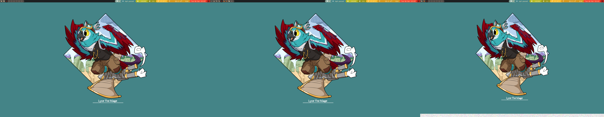
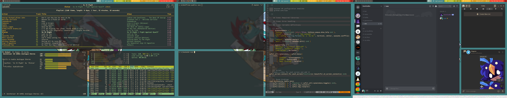

# Note

Do not install this repository on your pc, I heavily use stuff like `pass` and other things which only work with my setup and therefore please use this repository only to get inspiration or check how I did a specific thing!

# My dotfiles

* OS: Antergos
* Shell: Fish
* WM: herbstluftwm
* Theme: Oomox-Gruvbox-Dark
* Icons: Numix-Circle
* Termina: Termite ( Currently in migration to kitty )
* Terminal Font: Ubuntu Mono Powerline Nerdfont

# Screenshots:

## Empty (todo update)

## Full (todo update)

# Dotdrop Setup

* I have 4 profiles:
 * ovo: My main pc.
 * wsl: Windows Subsystem for Linux. 
 * mac: My works macbook.
 * sudo: For files in /etc or other directories which can only be written to with `sudo`/as root.

## ovo
Generally contains nearly all dotfiles since it's my main pc. 

## wsl
Just contains the most basic dotfiles for my linux subsystem on windows. 

(new)mutt with a default imap setup, git files, fish prompt and the bin directory for my scripts.

## mac
Similar to wsl, this also contains a minimal installation, though a bit more compared to wsl since it includes macos specific config files. (chunkwm, skhd, ...)

## sudo
Right now only contains one file, /etc/issues, which gets installed on my home pc. 

A friend of mine made a nice greeter for me and it makes me really happy whenever I see it!

## Secrets.env
This file needs to be created before I install the dotfiles from the [secrets.env.template](https://git.hoot.town/lyze/dotfiles-public/src/master/secrets.env.template) file.

In there I can specify all environment variables to use, e.g. email username/password, spotify app id...

Since I'm using `pass` for my passwords I can simply run it and get the first line for my passwords.

[Here's an example](https://git.hoot.town/lyze/dotfiles-public/src/master/dotfiles/config/mopidy/mopidy.conf#L116) on how I replace a config file with the `secrets.env` file.
